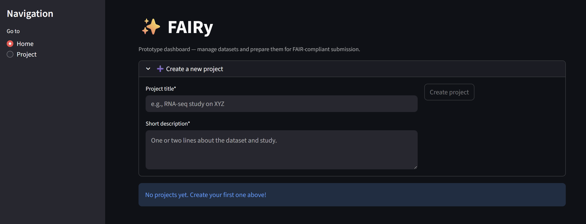

# ✨ FAIRy Skeleton

A minimal [Streamlit](https://streamlit.io/) prototype for preparing datasets for FAIR-compliant submission.  
This skeleton provides a **dashboard for projects** and a **tabbed wizard** for guiding metadata preparation.

---

## 📸 Screenshot

### Dashboard view


---

## 🚀 Getting Started

Clone the repo and set up a virtual environment:

```bash
git clone https://github.com/yuummmer/metadata-wizard.git
cd metadata-wizard   # or fairy-skeleton if you renamed it
python -m venv .venv
source .venv/bin/activate
pip install -r requirements.txt
streamlit run app.py
